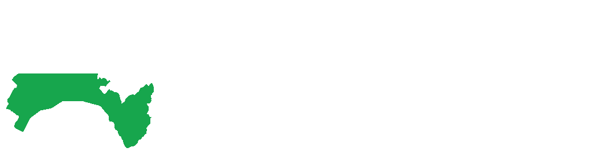

# Introduction


Ce projet est une application web pour des sentiers culturels. Il est développé dans le cadre du Projet d'articulation 2024 à la HEIG-VD.

# Installation dev

## Prérequis
- MAMP
  - [Installation de MAMP](https://www.mamp.info/en/downloads/)
- Composer
  - [Installation de Composer](https://getcomposer.org/download/)
- Node.js (npm est installé avec Node.js)
  - [Installation de Node.js](https://nodejs.org/en/download/prebuilt-installer/)
- Git
  - Windows avec GitBash
    - [Installation de GitBash](https://gitforwindows.org/)
  - Mac
    - [Installation de Git](https://git-scm.com/download/mac)

## Installation
Lancer MAMP ou WAMP et faire les commandes suivantes dans un terminal Bash

### Projet
Cloner le projet et se déplacer dedans grâce aux commandes suivantes
```bash
$ git clone https://github.com/LucaCDRocha/RELLL-ProjArt24.git
$ cd RELLL-ProjArt24
```

Installer les dépendances
```bash
$ composer install
$ npm install
```

Copier le fichier .env.example en .env soit en le copiant manuellement

soit avec la commande suivante
```bash
$ cp .env.example .env
```

Générer une clé pour l'application
```bash
$ php artisan key:generate
```

### Base de donnée
Avant de faire la suite des commandes pour la base de donnée, il faut, si ce n'est pas déjà fait, lancé MAMP ou WAMP.

Migrer les tables
```bash
$ php artisan migrate
```

Puis répondre yes à la question suivante (vous pouvez aussi appuyer sur entrée directement)
```bash
$ php artisan migrate

  WARN The database 'relll-projart' does not exist on the 'mysql' connection.

  Would you like to create it? (yes/no) [yes]:
 >
```

Remplir la base de donnée
```bash
$ php artisan db:seed
```

### Lancer les serveurs
Ouvrir un deuxième terminal et lancer les commandes suivantes dans cet ordre une par terminal
```bash
$ php artisan serve
$ npm run dev
```

# Installation de production
## Prérequis
- Serveur web (Apache, Nginx, etc.)
- PHP >= 8.2
- MySQL

## Installation
1. Clonez le projet dans le répertoire de votre choix :
```bash
$ git clone https://github.com/LucaCDRocha/RELLL-ProjArt24.git
```

2. Déplacez-vous dans le répertoire du projet :
```bash
$ cd RELLL-ProjArt24
```

3. Installez les dépendances PHP avec Composer :
```bash
$ composer install --no-dev --optimize-autoloader
```

4. Installez les dépendances JavaScript avec npm :
```bash
$ npm install --production
```

5. Copiez le fichier `.env.example` en `.env` :
```bash
$ cp .env.example .env
```

6. Générez une clé pour l'application :
```bash
$ php artisan key:generate
```

7. Configurez les informations de connexion à la base de données dans le fichier `.env`.

8. Migrez les tables de la base de données :
```bash
$ php artisan migrate --force
```

9. Remplissez la base de données avec les données initiales :
```bash
$ php artisan db:seed --force
```

10. Compilez les assets pour la production :
```bash
$ npm run prod
```

11. Configurez votre serveur web pour qu'il pointe vers le répertoire `public` du projet.

12. Lancez l'application en accédant à l'URL de votre serveur web.
